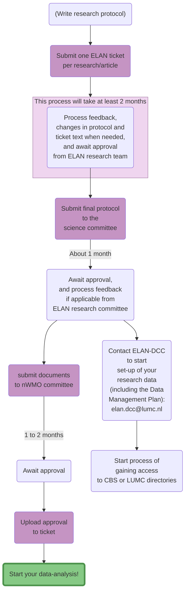
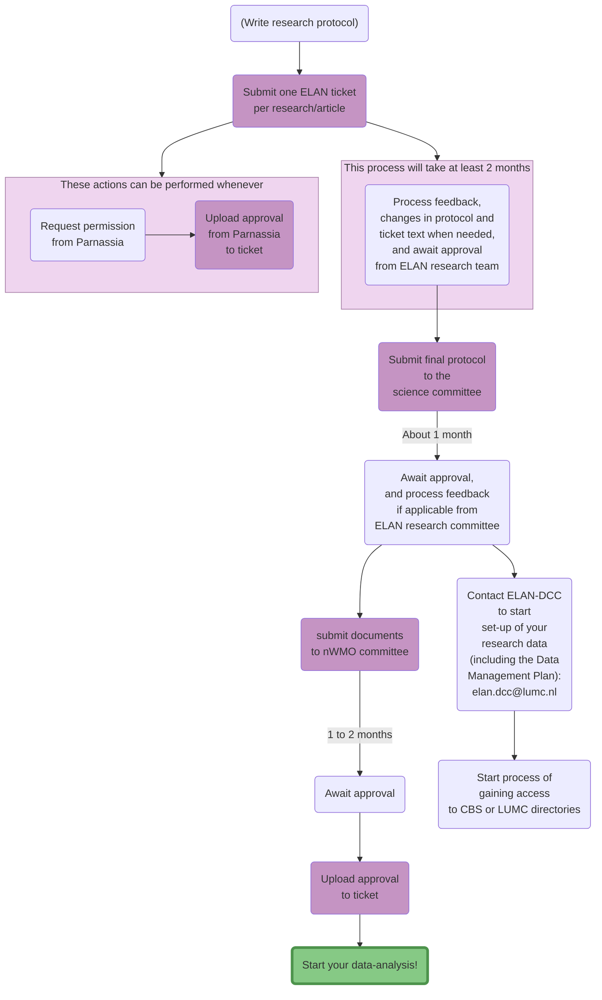
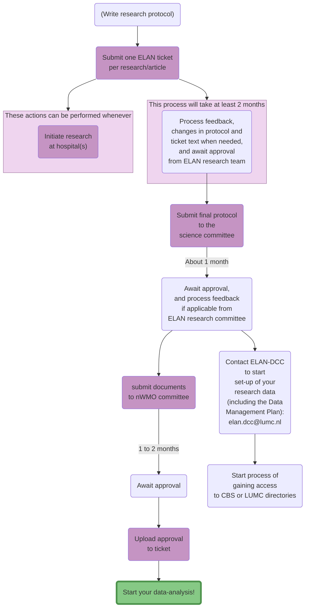
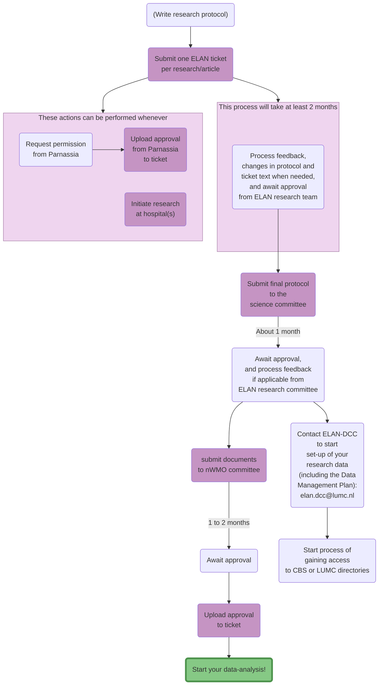

+++
title = 'Overview of steps to initiate data analysis'
menu = 'researchers_menu'
layout = 'page'
+++
Last update: 31-05-2024

# Overview of steps to initiate data analysis
To use the ELAN infrastructure and its data, you will need to take the steps shown in the flow chart below.
Some of the providers of our data, and for certain types of research, some additional steps need to be taken. These are displayed in the flow chart by selecting the following buttons if they are applicable to your situation.


    
    


The purple boxes are links to additional information or to platforms that allow you to perform the action in question.

You may have already finished writing your research protocol, in which case you can submit that to your ELAN ticket.

**Note that you need to follow *all* paths coming from each box**

{{ < comment >}}
Moeten we Perined + GGD + gemeente Den Haag + Hadoks ook toevoegen aan de Flowchart? Volgens Franks Guidance Doc moeten onderzoekers ook van die instanties expliciet toestemming vragen als ze die data willen gebruiken. Of vallen die mailtjes onder "Contact ELAN-DCC to start set-up of your research data"?
{{ < /comment >}}

