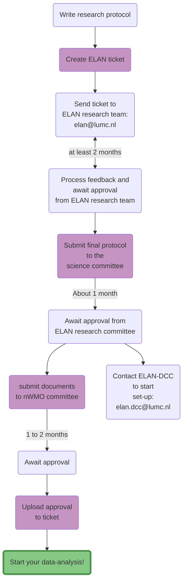
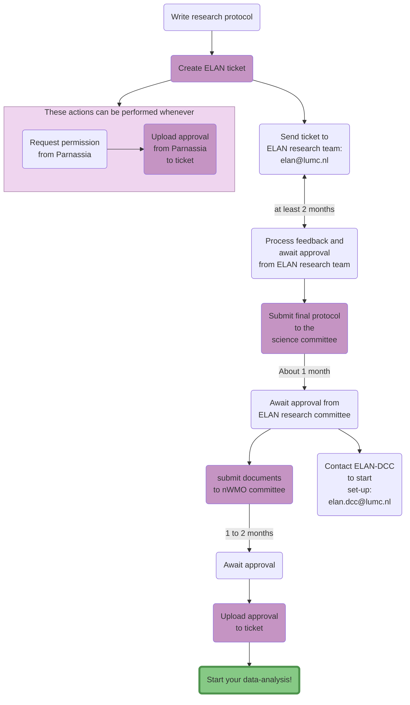
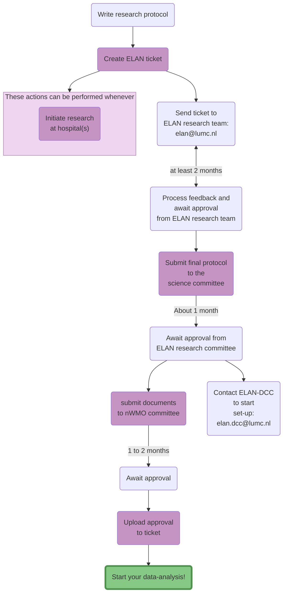
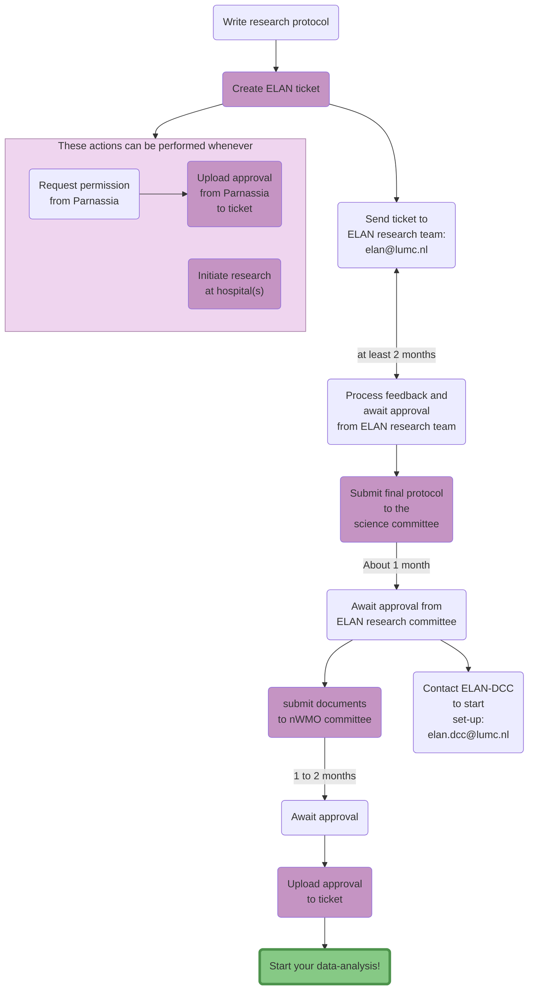

+++
title = 'Overview of steps to initiate data analysis'
menu = 'researchers_menu'
layout = 'page'
+++
Last update: 28-05-2024

Clicking on the purple portals will direct you to the right destination to perform the action in question.


    
    


